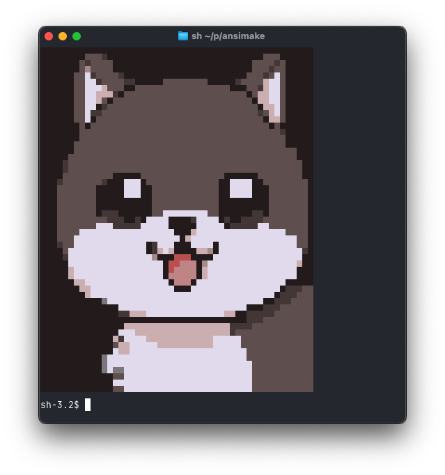

# ansimake



Quickly convert _pixel images of ANSI art created with AI_ to actual ANSI art.

## Features

- 🎨 **True Color Support** - Full 24-bit RGB color rendering
- 🖼️ **Multiple Formats** - Supports PNG, JPEG, GIF, and more
- 📐 **Smart Sizing** - Automatically fits to terminal size or custom dimensions
- 🎭 **Two Rendering Modes**:
  - Half-block mode (default) - Uses foreground and background colors for higher detail
  - Block mode - Uses full blocks
- 🎯 **Color Quantization** - Optional CIELAB-based color reduction for smoother output

## Installation

```bash
cargo install ansimake
```

Or build from source:

```bash
git clone https://github.com/yourusername/ansimake.git
cd ansimake
cargo build --release
```

## Usage

### Basic Usage

```bash
ansimake image.png
```

### Command Line Options

```bash
ansimake [OPTIONS] <IMAGE_PATH>

Options:
  -b, --bw              Convert to black and white
  -w, --width <WIDTH>   Output width (maintains aspect ratio if height not specified)
      --height <HEIGHT> Output height (overrides aspect ratio if specified with width)
  -t, --tolerance <TOL> Color tolerance/distance threshold (default: 0)
  -B, --blocks          Use block characters with foreground colors only
  -h, --help            Print help
```

### Examples

The goal was to built a tool that converts an _ansi-looking_ source image to its actual ANSI output, and so it works best in these conditions

#### Before


#### After


```bash
# Convert with custom width
ansimake photo.jpg -w 100

# Black and white conversion
ansimake image.png -b

# Use block mode for simpler rendering
ansimake image.png -B

# Color quantization for smoother output
ansimake image.png -t 15
```

## Library Usage

```rust,no_run
use ansimake::{Image, ConversionConfig};

fn main() -> Result<(), Box<dyn std::error::Error>> {
    // Load an image
    let img = Image::load("image.png")?;

    // Optionally convert to grayscale
    let img = img.to_grayscale();

    // Configure conversion
    let config = ConversionConfig {
        size: (80, 24),
        use_blocks: true,
        color_tolerance: 10.0,
        ..Default::default()
    };

    // Convert to ANSI art
    let ansi_art = img.to_ansi(&config);
    println!("{}", ansi_art);
    Ok(())
}
```


## Requirements

- Rust 1.70+ (for building from source)
- A terminal with true color support (most modern terminals)

## License

MIT License - see LICENSE file for details

## Contributing

Contributions are welcome! Please feel free to submit a Pull Request.
